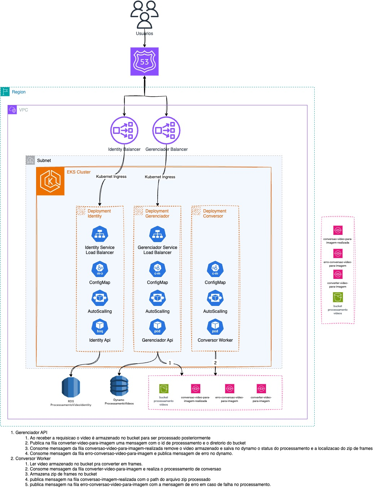

# Controle de Pedidos

Este repositório contém as atividades (Hackaton) da Pós Graduação em Arquitetura de Software.

## Autores

- [Flávio Roberto Teixeira](https://github.com/FlavioRoberto)

## Tecnologias Utilizadas

- .NET 8
- Entity Framework Core
- AWS
- Terraform
- Docker
- Kubernets
- Swagger
- PostgreSQL

## Arquitetura


## Documentação

- [Domain Event Storming](https://www.figma.com/board/fHGDc1i4RxCmrrsPomCD4E/Domain-Event-Storming-Tech-Challenge?node-id=0%3A1&t=TI5wBxdhle65UPSn-1): Este link direciona para o Domain Event Storming, fornecendo uma visão geral visual do projeto.
- [Demonstração da Arquitetura (em vídeo)](https://www.youtube.com/watch?v=6ygqioJ6_Rs&ab_channel=Kenobirt)
- Collection: A collection do postman está localizada na pasta docs/collection

## Desenho de Arquitetura


## Execução do projeto com Kubernetes (K8S)

### Helm

Para instalar o projeto usando Helm, siga estes passos:

1. Navegue até a pasta `infra` do seu projeto.

2. Execute o seguinte comando, especificando o diretório onde os arquivos do banco estão localizados. Por exemplo, se os arquivos do banco estão em `/Users/seu-usuario/banco-dados`:

   ```bash
   helm install processamento-video ./processamentovideo-chart 
   ```

## Gerando Relatórios de Testes

Para gerar relatórios de testes com cobertura de código, siga estas instruções:

1. Execute os testes com cobertura de código usando o seguinte comando no terminal:

```bash
dotnet test /p:CollectCoverage=true --verbose
```

Isso executará os testes e gerará um relatório de cobertura de código no formato padrão.

Após a execução dos testes, gere o relatório de cobertura usando o seguinte comando no terminal:

```bash
reportgenerator -reports:coverage.opencover.xml -targetdir:Coveragereport -reporttypes:Html
```

Isso gerará um relatório HTML de cobertura de código no diretório Coveragereport.

Abra o arquivo index.html dentro da pasta Coveragereport para visualizar o relatório de cobertura gerado.

